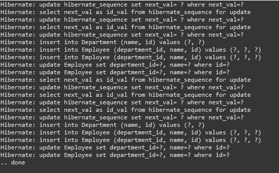
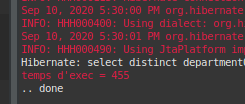
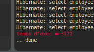
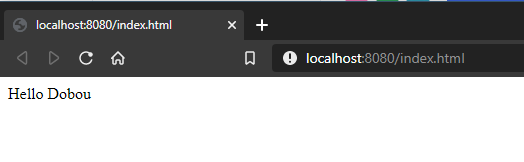
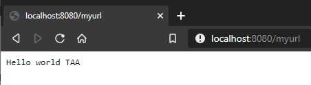
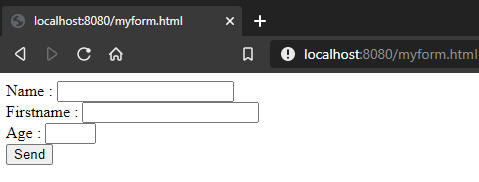
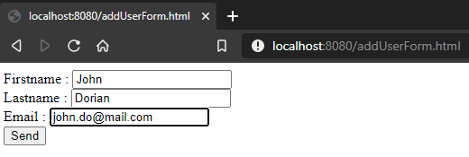
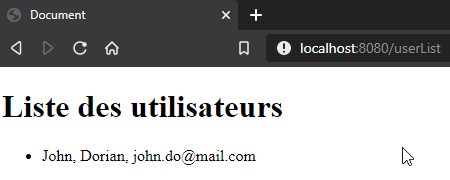

# TP1 JPA (+ Partie 1 TP2 servlets)

## Auteurs 

- Nils Richard
- Dorian Bouillet

## Question 1, 2 et 3

*cf. n'importe quelle classe dans le package* `domain` *et* `dao` 

Pour les classes DAO nous avons utilisé `AbstractJpaDao` pour simplifier et généraliser celles-ci.

## Question 4

Il était impossible de créer une BDD sur le site indiqué, nous avons donc utilisé des BDD locales et mis cette dépendance à la place :

```
<dependency>
    <groupId>mysql</groupId>
    <artifactId>mysql-connector-java</artifactId>
    <version>8.0.11</version>
</dependency>
```

## Question 5

Voici un exemple de requête utilisant criteria query (trouvable dans `BoardKBDao`):

```java
public BoardKB findByName(String name) {
    CriteriaBuilder cb = entityManager.getCriteriaBuilder();
    CriteriaQuery<BoardKB> cq = cb.createQuery(BoardKB.class);

    Root<BoardKB> board = cq.from(BoardKB.class);
    Predicate boardNamePredicate = cb.equal(board.get("name"), name);
    cq.where(boardNamePredicate);

    TypedQuery<BoardKB> query = entityManager.createQuery(cq);
    return query.getSingleResult();
}
```

cf. le package `dao` pour l'implémentation des classes DAO.

Étant donné qu'il n'y a pas de REST dans ce repository, cette question nous paraît étrange et nous semble vouloir 
parler du prochain TP. Vous trouverez ainsi une utilisation de nos classes DAO dans un service REST dans le TP2 : 
https://github.com/NilsRichard/Master2_KanbanApp

Si nous avions une implémentation REST dans ce repo, nous devrions instancier nous même les DAO avant de pouvoir les 
utiliser, c'est sûrement le problème dont il est demandé de discuter. Il faudrait utiliser un système d'injection de 
dépendances afin d'éviter l'interdépendance de classes concrètes.

Avec un système d'injection de dépendance via annotations *`@Autowired`*, il serait bien plus simple d'appeler les 
classes DAO sans devoir se soucier des instanciations et des injections de dépendance.

## Question 6

##### Initialisation de la BDD



##### Joinfetch



##### N1select




On voit une large différence de performance entre les deux techniques.

On remarque également une seule requête pour le join fetch contre un nombre très élevé de requêtes avec le N+1 select.


# Partie 1 TP2 (servlets)

## Question 1

*cf. Configuration dans le* `pom.xml`

## Question 2



## Question 3



## Question 4



## Question 5

On ajoute un utilisateur :



On le retrouve dans la liste des utilisateurs dans la BDD :




## Question 6
*Vous trouverez la suite de ce TP dans le second repository :* 

https://github.com/NilsRichard/Master2_KanbanApp